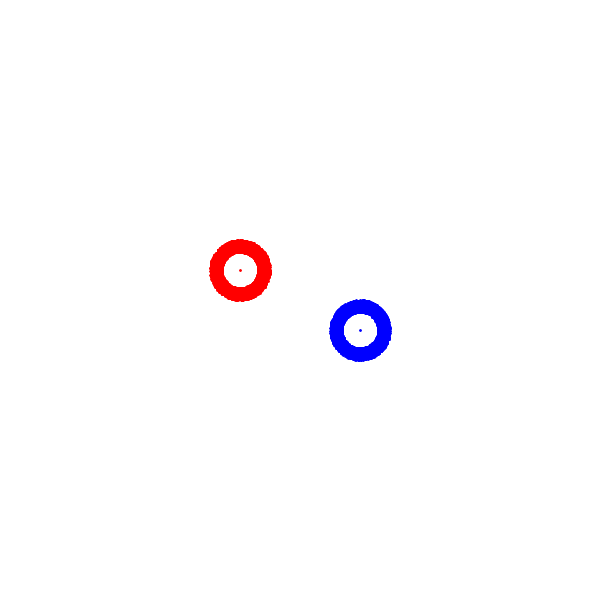

# ISO C++ Parallel Algorithms for n-body simulations on multi-core CPUs and GPUs



This repository provides multiple parallel n-body simulation algorithms, implemented in portable ISO C++ that runs on multi-core CPUs and GPUs:
- All-Pairs; $O(N^2)$ time complexity:
  * Classic `all-pair`, parallelized over bodies.
  * `all-pairs-collapsed`, parallelized over force pairs.
- Barnes-Hut ; $O(N \log N)$ time complexity:
  * Starvation-free `octree` algorithm: requires _parallel forward progress_.
  * Hilbert-sorted Bounding Volume Hierarchy (`bvh`) algorithm: requires _weakly parallel forward progress_.
  
# Reproducing results

Pre-requisites: `docker` and [HPCCM](https://github.com/NVIDIA/hpc-container-maker):

```shell
$ pip install hpccm
```

Run samples as follows:

```shell
# Options
# ./ci/run_docker <toolchain> <algorithm> <workload case> <dim> <precision> <bodies> <steps>
# Example: nvc++ gpu compiler, octree algorithm, galaxy simulation, 3D, double precision:
$ ./ci/run_docker nvgpu octree galaxy 3 double
# Build, but not run:
$ BUILD_ONLY=1 ./ci/run_docker nvgpu octree galaxy 3 double
# Run assuming binary is built:
$ RUN_ONLY=1 ./ci/run_docker nvgpu octree galaxy 3 double
```

To reproduce without a container, a properly set up environment is required, in which case the `./ci/run` script can be used instead.

Following options available:

- Toolchain:
  * Open-source vendor-neutral: `acpp` ([AdaptiveCpp](https://github.com/AdaptiveCpp/AdaptiveCpp)), `gcc` (Intel TBB), `clang` (Intel TBB), 
  * Vendor-specific: 
    - AMD ROCm stdpar: `amdclang`.
	- NVIDIA HPC SDK: `nvgpu` (`nvc++ -stdpar=gpu`), `nvcpu` (`nvc++ -stdpar=cpu`).
	- Intel oneAPI: `dpc++`
- Algorithm: `all-pairs`, `all-pairs-collapsed`, `octree`, `bvh`.
- Dimensions: `2` (2D), `3` (3D).
- Precision: `float`, `double`.
- Workloads:
  * `galaxy`
  * `nasa`: loads data-set from file, requires using `./ci/run_docker thuering fetch` for set up.

To run all benchmarks on a given systems, you can use `./ci/run_docker bench`.

# License

MIT License, see [LICENSE](./LICENSE).

# Citing

Thomas Lane Cassell, Tom Deakin, Aksel Alpay, Vincent Heuveline, and Gonzalo Brito Gadeschi. "Efficient Tree-Based Parallel Algorithms for N-Body Simulations Using C++ Standard Parallelism." In Workshop on Irregular Applications: Architectures and Algorithms Held in Conjunction with Supercomputing (P3HPC). IEEE, 2024.

https://research-information.bris.ac.uk/en/publications/efficient-tree-based-parallel-algorithms-for-n-body-simulations-u

# Contributing code

When contributing code, you may format your contributions as follows:

```shell
$ ./ci/run_docker fmt
```

but doing this is not required.

# Reproducing with mamba

## Installing

The environment is made portable through mamba/conda.
This must be installed as a prerequisite, e.g., run the Miniforge installer from https://github.com/conda-forge/miniforge .
Then create the `stdpar-nbody` environment:
```bash
$ mamba env create -f environment.yaml
```
<!-- `mamba env export --from-history --name stdpar-nbody` -->

Other things you might want:
- NVIDIA HPC SDK
<!--- Intel oneAPI Base Toolkit-->

## Building
Use `make` to build the program.
This must be done within the mamba environment:
```bash
$ mamba activate stdpar-bh
```
The number of dimensions can be specified with `D=<dim>` parameter to `make`.
By default `D=2` is used.
These are the available targets:

**CPU**

- `make gcc`
- `make clang`
- `make nvcpp`

**GPU**
- `make gpu` to build for NVIDIA GPUs using `nvc++`

The output will be `./nbody_d<dim>_<target>`.
<!-- makelocalrc -gcc $(which gcc) -gpp $(which g++) -x -d . -->

### Run configuration
When running the `nvcpp` version, it is recommended to use the following environment variables:
```bash
OMP_PLACES=cores OMP_PROC_BIND=close ./nbody_d2_nvcpp -s 5 -n 1000000
```

If you get an error about missing libraries then try running with the following environment variable:
```bash
LD_LIBRARY_PATH=${CONDA_PREFIX}/lib ./nbody_d2_clang -s 5 -n 1000000
```

## Examples
Run Barnes-Hut with $\theta=0$ and compare with all pairs algorithm.
Run 5 steps with 10 bodies.
They should have the same output.
```bash
$ ./nbody_d2_gpu -s 5 -n 10 --print-state --theta 0
$ ./nbody_d2_gpu -s 5 -n 10 --print-state --algorithm all-pairs
```

Run a large Barnes-Hut simulation with 1,000,000 bodies:
```bash
$ ./nbody_d2_gpu -s 5 -n 1000000
```

Generate a similar image to the above GIF:
```bash
$ ./nbody_d2_gpu -s 1000 -n 10000 --save pos --workload galaxy
$ python3 scripts/plotter.py pos --galaxy --gif
```

To find other program arguments:
```bash
$ ./nbody_d2_gpu --help
```
